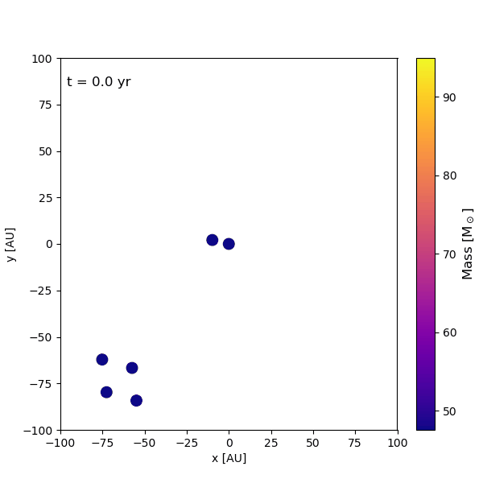
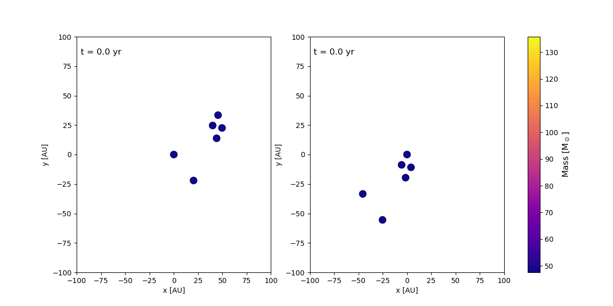
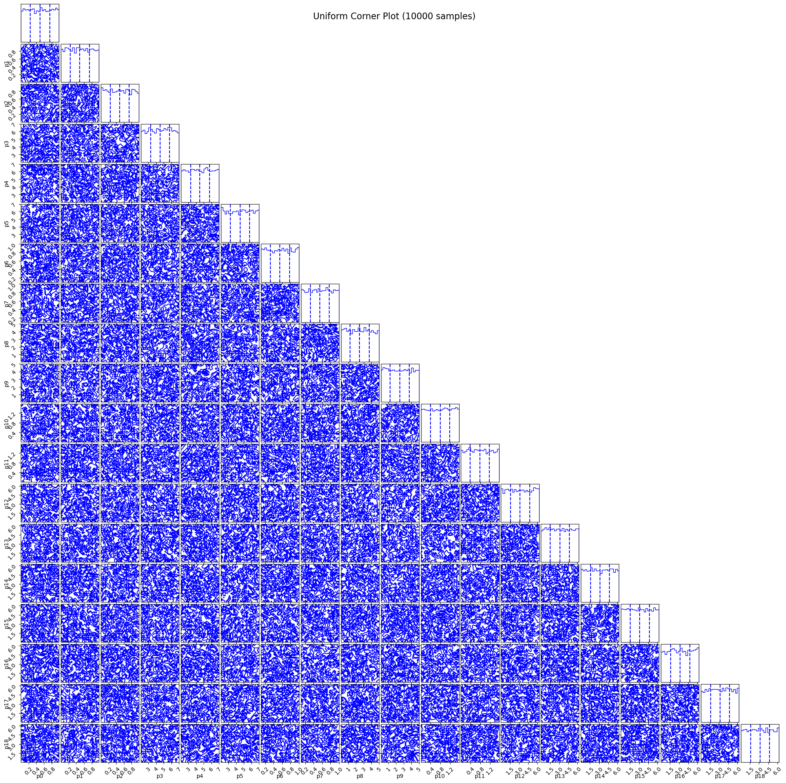
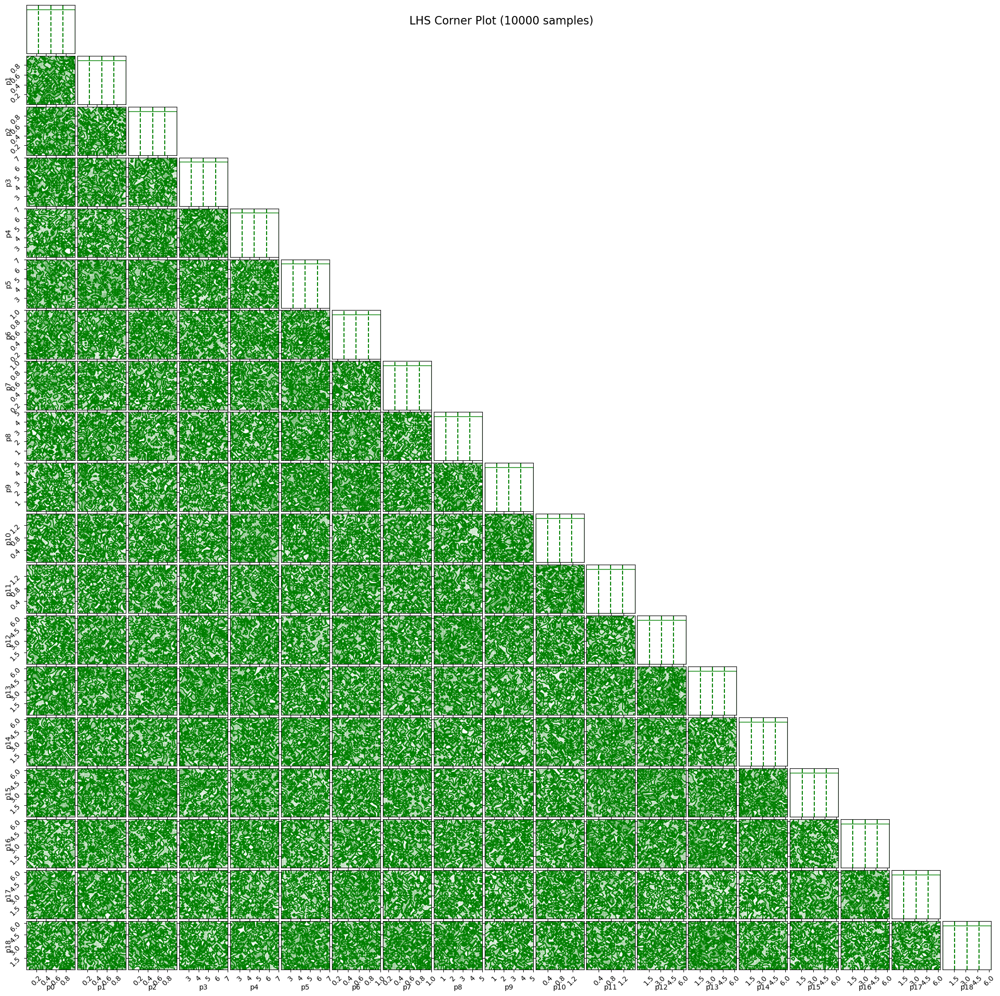
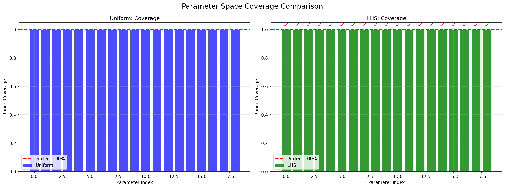
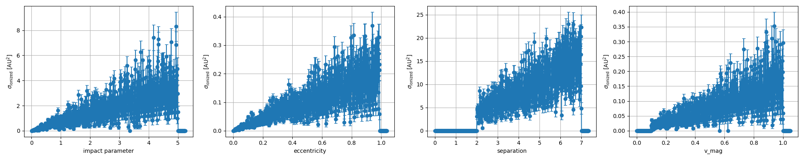

# strw-amuse-project

This is the README document for strw-amuse-project, a project for the 2025 [***Simulation and Modeling in Astrophysics (AMUSE)***](https://studiegids.universiteitleiden.nl/en/courses/130588/simulation-and-modeling-in-astrophysics-amuse) lecture hosted at [**Leiden Observatory**](https://local.strw.leidenuniv.nl/).

**Dated:** 2025-October-04

## Index

- [strw-amuse-project](#strw-amuse-project)
  - [Index](#index)
  - [Collaborators](#collaborators)
  - [Usage and Notes](#usage-and-notes)
  - [Goals](#goals)
    - [Idea](#idea)
    - [Assumptions](#assumptions)
    - [Some interesting questions](#some-interesting-questions)
  - [Example](#example)
  - [Example plots](#example-plots)
  - [Archived](#archived)
    - [Steps](#steps)
    - [Configs](#configs)
    - [Alternative Approach](#alternative-approach)

## Collaborators

We list the collaborators in alphabetical order.

| Collaborator           | Contact                                                                 | Program       | Institution       |
| ---------------------- |------------------------------------------------------------------------ | ------------- | ----------------- |
| **Eirini Chrysovergi** | [chrysovergi@strw.leidenuniv.nl](mailto:chrysovergi@strw.leidenuniv.nl) | MSc Astronomy | Leiden University |
| **Marc Seegers**       | [seegers@strw.leidenuniv.nl](mailto:seegers@strw.leidenuniv.nl)         | MSc Astronomy | Leiden University |
| **Taotao Yang**        | [tyang@strw.leidenuniv.nl](mailto:tyang@strw.leidenuniv.nl)             | MSc Astronomy | Leiden University |

## Usage and Notes


- Run project locally with [`main.py`](./main.py).
- Configurations in [`config.py`](./src/strw_amuse/utils/config.py).
- Check [`Documentation`](./docs/)(./docs/AMUSE_Install_v2025.9.0.md) for `AMUSE`.installation setup and example script for `AMUSE` simulations.
- Require `AMUSE` [`v2025.9.0`](https://github.com/amusecode/amuse/releases/tag/v2025.9.0) for current project.
- See [`environment.yml`](./environment.yml) for `Conda` environment.
- See [`pyproject.toml`](./pyproject.toml) for `Black` config.
- See [`setup.cfg`](./setup.cfg) for `isort` and `flake8` config.
- See [`mc.sh`](./mc.sh) for running jobs on some HPC.

## Goals

Generate probability estimation of pistol star formation based off of some configurations of star system interactions inside a cluster.

### Idea

- Shoot a triplet or binary at some host triplet or binary-binary system.
- Use host triplet/quintuplet system as point of reference.
- Get probability of these trails ejecting pistol star.
  
### Assumptions

- Close encounter event of bin-bin-bin or tri-tri has happened in some cluster.
- Interaction take place in localized spatial environment
- Distant effect of other stars in the cluster is trivial.

### Some interesting questions

- How likely to form in bin-bin-bin or tri-tri configuration?
- How is the cross section of pistol star ejection dependent on parameter space?

## Example

Use [`main.py`](main.py) as an example on how to run one simulation run of this project.

```py
# ./main.py

# due to common `AMUSE` issue
# use `warnings` for warning message supression
import warnings 

warnings.filterwarnings(
    "ignore",
    message="pkg_resources is deprecated as an API",
    category=UserWarning,
)

# multiprocessing lib
import multiprocessing

from src.strw_amuse.core import convert
from src.strw_amuse.plots import visualization
from src.strw_amuse.sims import mc
from src.strw_amuse.utils import logger


if __name__ == "__main__":
    # init logger
    logger.setup_logging()

    # force mp
    multiprocessing.set_start_method("spawn", force=True)

    # get mc results
    result = mc.monte_carlo_19D(n_samples=10, n_workers=10)

    # local repo
    dir_path = "./data/mc/"
    file_path = "./data/mc/mc_result_combined.npz"
    outcome_name = "Creative_ionized"
    n_bins = 10

    # combine all mc results into singular file
    convert.to_one_npz(dir_path=dir_path, file_path=file_path)

    # visualiza mc results
    visualization.visualize(file_path=file_path, outcome_name=outcome_name, n_bins=n_bins)

```

For runnin on HPC, use [`mc_hpc.py`](./mc_hpc.py) as an exmaple.

```py
# ./mc_hpc.py

# due to common `AMUSE` issue
# use `warnings` for warning message supression
import warnings

warnings.filterwarnings(
    "ignore",
    message="pkg_resources is deprecated as an API",
    category=UserWarning,
)

import logging
import multiprocessing
import os

from src.strw_amuse.sims import mc
from src.strw_amuse.utils import logger

if __name__ == "__main__":
    # logger init
    logger.setup_logging()
    logs = logging.getLogger(__name__)

    # force mp
    multiprocessing.set_start_method("spawn", force=True)

    # local repo
    total_samples = 100000                          #<-- total sample size
    n_jobs = 10                                     #<-- must match SBATCH --array, faster when set high
    samples_per_job = total_samples // n_jobs       #<-- get per job samples

    # set job by slurm array index (0-based)
    job_idx = int(os.environ.get("SLURM_ARRAY_TASK_ID", "0"))
    # samples to run per job
    n_samples = samples_per_job
    # set node specific n_workers ~ n_cores to use for mp
    # n_cores <- hardware | n_workers <- software 
    n_workers = 20 

    # get mc results and save
    result = mc.monte_carlo_19D(
        n_samples=n_samples,
        n_jobs=n_jobs,
        job_idx=job_idx,
        verbose=True,
        n_workers=n_workers,
        save=True,
    )

    # do a quick summary <- not necessary for hpc runs
    logs.info("\n=== Local MC test finished ===")
    logs.info(f"Samples used: {result.samples.shape[0]}")
    logs.info(f"Unique outcomes: {len(result.unique_outcomes)}")
    if result.probabilities.size:
        logs.info("Outcome probabilities:")
        for u, p in zip(result.unique_outcomes, result.probabilities):
            logs.info(f"{u}: {p:.3f}")
    else:
        logs.info("No collisions or no successful outcomes recorded.")

```

Along with [`mc.sh`](./mc.sh). Exammple given for generice `ALICE` based jobs.

```sh
#!/bin/bash
#SBATCH --job-name=JOB_NAME_HERE        #<-- set your job name
#SBATCH --export=NONE                   #<-- no export expected
#SBATCH --output=PATH_TO_DATA/%A_%a.out #<-- set output.out file path
#SBATCH --error=PATH_TO_DATA/%A_%a.err  #<-- set error.err file path
#SBATCH --mail-user="YOUR_EMAIL_HERE"   #<-- set email address
#SBATCH --mail-type=ALL                 #<-- use END,FAIL for cleaner emails
#SBATCH --time=RUN:TIME:HERE            #<-- set max sim run time before job exit
#SBATCH --partition=HPC_PARTITION_HERE  #<-- set partition for job run
#SBATCH --nodes=1                       #<-- current mp setup dependent
#SBATCH --ntasks-per-node=NUM_OF_TASKS  #<-- use according to quota allowance
#SBATCH --cpus-per-task=1               #<-- no point putting more than 1 for current mp setup
#SBATCH --mem-per-cpu=5G                #<-- 2-3G mem usually suffice
#SBATCH --array=0-9                     #<-- array idx should match n_jobs in `mc_hpc.py`

# ALICE specific
module purge
module load ALICE/default
module load Miniforge3

# conda init and activate env
source "$(conda info --base)/etc/profile.d/conda.sh"
conda activate amuse-py313

export CWD=$(pwd)
export DATE=$(date)

echo "[$SHELL] #### Starting Script"
echo "[$SHELL] ## USER: $SLURM_JOB_USER | ID: $SLURM_JOB_ID | TASK"
echo "[$SHELL] ## current working directory: "$CWD
echo "[$SHELL] ## Run script"

# main exec
python mc_hpc.py

echo "[$SHELL] ## Script finished"
echo "[$SHELL] ## Job done "$DATE
echo "[$SHELL] ## Used $SLURM_NTASKS cores"
echo "[$SHELL] ## Used $SLURM_CPUS_ON_NODE processors/CPUS"
echo "[$SHELL] ## Used $SLURM_CPUS_PER_TASK processors/CPUS per task"
echo "[$SHELL] #### Finished Monte Carlo. Task complete."
```

We could similarly automate results gathering and combination for plotting in `mc_hpc.py`.

## Example plots

At some Monte Carlo run performed with a prior version of the project code base, we generated the following plots.

| Plot | Description |
|------|-------------|
|  | Refrencase case of binary-binary-binary interaction. |
|  | Test case of binary-binary-binary interaction with creative ionized outcome. |
|  | Uniform sampler param space coverage |
|  | Latin Hypercube sampler param space coverage |
|  | Param coverage 1-d comparison |
|  | Cross section dependency over selective parameters |

---

## Archived

<details>
<summary>Read More...</summary>

### Steps

> I/O:
>
>input param -> config (init conditions)\
>func()\
>output -> Ejected (T/F) -> if ejected -> ejected item (mass, velocity)\
> check if ejected item is max mass item in system -> if not -> continue till max mass ejected

This summarize into:

> Overall:
>
> a whole wow of input param <- find optimal params to use <- MC?\
> run all configs\
> get all results\
> output -> num_max_mass_ejected/total_configs <- prob of max mass ejection\
> output -> the max mass of the ejected max mass items

### Configs

> param:
>
> mass\
> eccentricity <- if bin\
> separation <- if bin\
> centers of mass/bin\
> velocity and directions

```py
def param_builder(some_param):
    *some_param = (
        config,
        if_bin,
        num_bin,
        num_single,
        masses,
        velocity,
        separation,
        centers,
        direction,
    )
    if config == (4, 2): # 4 bin 2 single
        param = (masses of bin, mass of single, centers, direction, velocity, separation)
    elif config == (0, 6):
        param = sss
    return param
```

```py
def func(some_param):
    param = param_builder(some_param)
    run_sim(param)
    results = (mass, velocity, spin)
    return results
```

### Alternative Approach

```py
init_param = (n_bin, n_single, r_cluster, age_cluster)
```

```py
def particle_assign(init_param):
    masses, sep, velocity, location = model(init_param)
    intermediate_param = (
        masses,
        sep,
        velocity,
        location,
    )
    return intermediate_param
```

```py
def sim(intermediate_param, time_step):

    # add
    stellar_evolution
    gravity
    
    # hydro
    if close_encounter:
        hydro()
        replace collide with new
    
    # ejection
    if ejected:
        # mass check
        if mass < max_mass:
            continue
        else:
            results = (
                (mass_ejected_star, velocity, spin),    # ejected results
                (mass_cluster, r_cluster),              # cluster results
                ejected_flag,                           # if ejected at this config
            )
    
    # plot
    plotter()
    # return
    return results
```

```py
def pseudo_prob(num_true_flag, num_config): #????? -> MC? -> Literature
    num_flag = num_true_flag
    return num_flag/num_config # prob of pistol inside selected number of configs
```

```py
def plotter(args):
    *args = mass, location, time
    plt.plot(args) # cmap with numbered output
    plt.save(f"cmap_{time}")
```

</details>
